# LearningCPP
_just learning c++_

- to run we do: `g++ .\<file name>.cpp -o "<executable name>"`
- to do casting we can do: `static casting <type>`
- we can use public or private methods when creating classes
- Constructors are used to initialize the object's data members and perform any setup required for the object to be in a valid and usable state
- 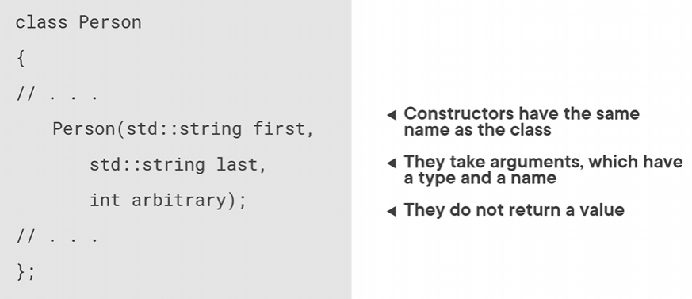
- constructors are basically a blue print with predefined data and you can use it anytime
- heaps are for slower allocations while stacks are for faster ones
    - but stacks have limited space while heaps do not
- the little colon in constructors is where we define constructor initialization
    - this means that after initializing the types and declarations, you can initiazlize the variabled after the colon like this:
    - also keeping in mind that we dont have to add anything to the body of the contructor
- 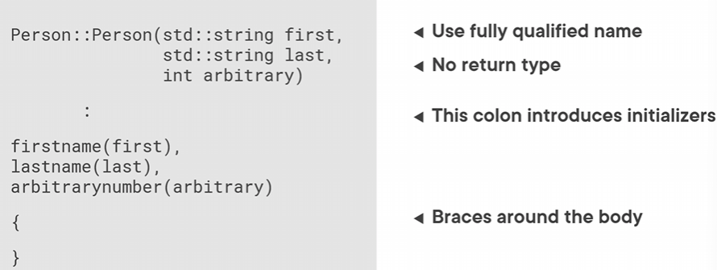
- example below has a constructor file with the private and public declarations of variables
- 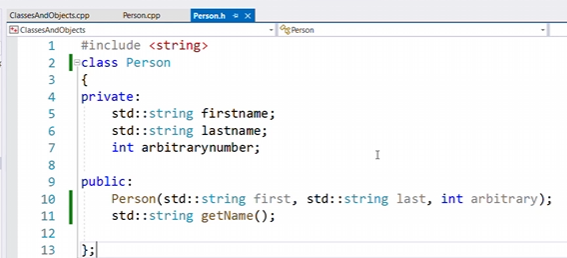
- 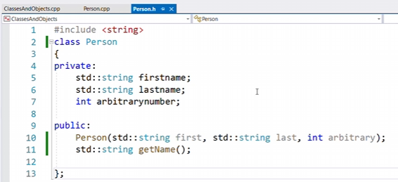
- 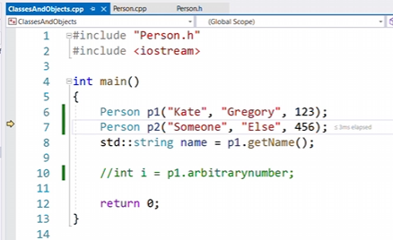
- a decontructor is called when a member of a class goes out of scope or is deleted and the purpose of the decontructor is to perform cleanup and release any resources like memory, file handles etc that the object might have aquired during its lifetime
- 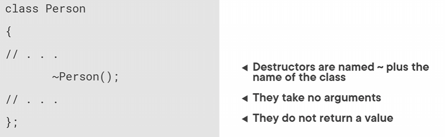
- 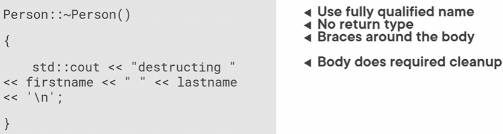
- destructures usually are used when we are working with data and we know we will have to clean it but usually its automatically created
- struct is a way to group several related variables into one place
- 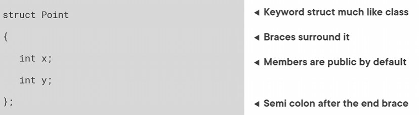
- namespaces are used to reserve words 
- enum gives a name to a group of similar things 
- Enums are particularly useful in several scenarios where you have a set of related constant values that represent distinct options or states
- enum example setting
- 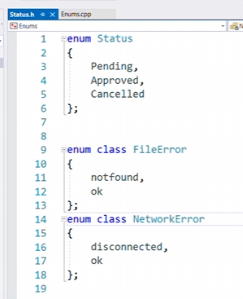
- 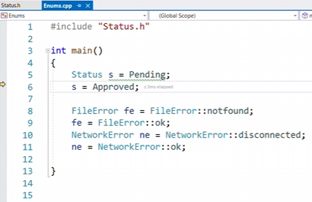
- preprocessors are the ones ran before our code like the #include
- 'immidiate if' is an operator in cpp that takes 3 operators but the correct wording is 'ternary operator' and it works by putting the if else in one statement `condition ? expression_if_true : expression_if_false;` 
- 'goto' in cpp allows you to transfer the control flow of a program to a specified labeled statement within the same function or block of code
- while loops you need a true condition until its false
- if loop follows: initializer; condition; loop expression
    - we can also use something called 'range for' where we can iterate over the elements of a range, such as an array, a container
- 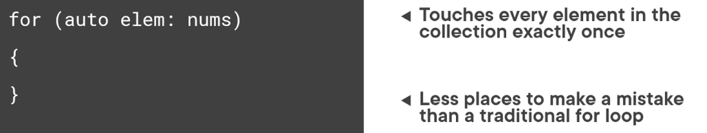
- the image above says for each elem do nums
- 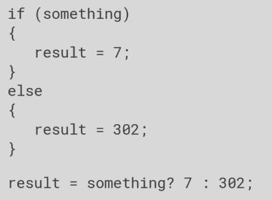
